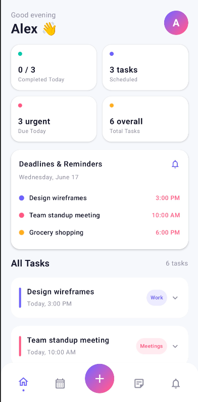
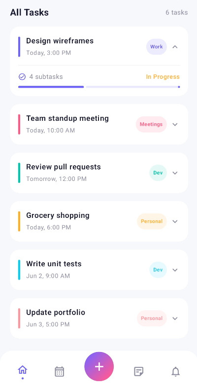

### ToDo App – Jetpack Compose Task Manager

A modern, feature-rich ToDo application built using Jetpack Compose that helps users organize tasks efficiently with a clean UI, smooth interactions, and intuitive task management features.
---

## 🎓 Internship Details

- Intern ID: CITS1726
- Project: Recipe Finder Android App

---

## Features
➕ Add new tasks with title, category, color, and deadline

📅 Date & Time picker for setting task deadlines

🏷️ Category-based task organization (Work, Personal, Dev, etc.)

🎨 Color-coded tasks for better visual prioritization

📊 Dashboard showing task statistics (Completed, Due, Total tasks)

📥 Bottom sheet UI for adding tasks

🧠 Swipe gestures:

➜ Swipe right → Mark as completed

⬅ Swipe left → Delete task

📌 Expandable task cards with subtasks & progress indicator

🔔 Deadline reminder section for today's tasks

🌈 Modern Material 3 UI with animations

---
## Tech Stack
Kotlin
Jetpack Compose
Material 3 Design
Android SDK
State management using remember & mutableStateListOf
Android system components:
DatePickerDialog
TimePickerDialog

---
## Architecture Overview

This project follows a simple single-activity Compose architecture:

MainActivity → Entry point
HomeScreen() → Main dashboard UI
AddTaskSheet() → Bottom sheet for task creation
TaskCard() → Individual task UI with swipe gestures
StatsGrid() → Task analytics cards
BottomNavBar() → Navigation UI

All UI is built using Composable functions with reactive state handling.
---

## Future Improvements
💾 Add Room Database for persistent storage
🔔 Add notifications & reminders using WorkManager
🔍 Add task search and filters
☁️ Cloud sync support
📊 Advanced analytics dashboard
---
## Screenshots

  
  
  

